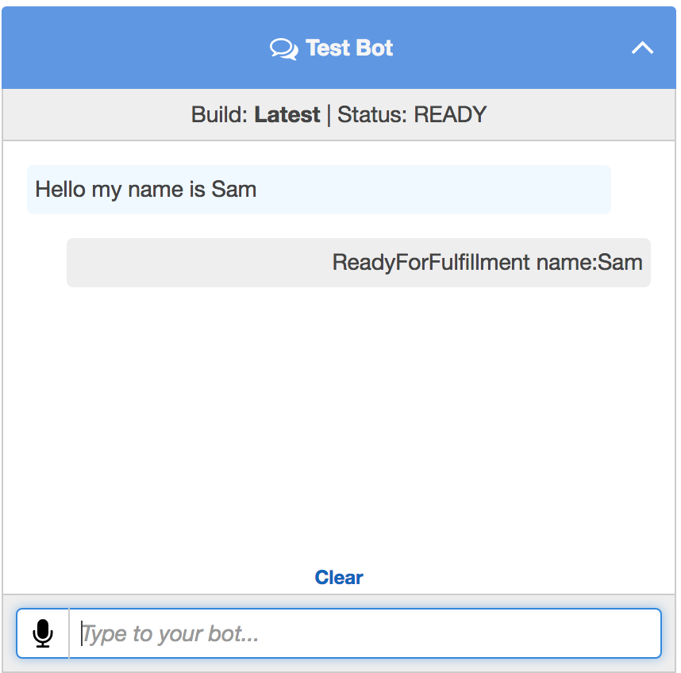
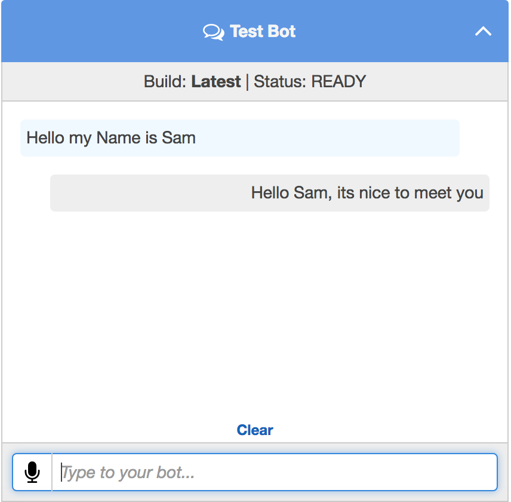

In this example, we will be creating a simple Lex bot that uses a Lambda function to recognise your name and reply to you with a greeting, we will then show you how to connect to the bot via a Nexmo powered phone call.

## Setup IAM

 - Login to the AWS Console and go to the IAM console.

 - Create a role called 'lambda-lex'.

 - In the policy section, attach 'AmazonLexRunBotsOnly' policy.
 
 - Next create a user called 'lex-connector'
 
 - Attach the existing policy named 'AmazonLexRunBotsOnly'
 
 - Select the Security Credendtials Tab and Generate a set of Access Keys
 
 - Keep a note of the Access Key ID and Secret.
  

## Create Lex Bot and Intent

 - In the Lex console click Create then choose 'Custom Bot'.

 - Use 'HelloName' for the name.

 - Pick any Output Voice.

 - Set session timeout to 2 minutes.

 - Use 'No' for the 'COPA' question.

 - Click create. This creates the bot structure for our bot.

 - Now, create an Intent with the name 'HelloName'.

 - Fill out the fields as shown in the screenshot. This example is fairly simple but you can customise it if you want to experiment.
 


 - Next create a slot called `name` and set the Slot type to `AMAZON.US_FIRST_NAME`, under prompt enter `Who are you`


 - Now, click the "Build" button to build this. This usually takes about 5 to 10 seconds.

 - Test the bot in the web interface. This ensures our basic bot is working. We will come back to this after we finish configuring Lambda.
 
 

 

## Create Lambda Function

 - Now, go to the Lambda console, click 'Create a Function', then choose the 'Blank Function' template.
 
 - Leave the trigger selection blank and click Next.
 

 - Name your function `lex_helloname` and add a description, select Node.js 4.3 as your runtime.

 - Copy and paste the contents of [lex_helloname.js](./lambda/lex_helloname.js) into the Lambda code text area.

 - In the `Function handler` leave as index.handler under `role section`, select the 'lambda-lex' role created earlier.

 - Remaining options can be left as default

 - Choose create function.

 - Once created, choose actions and 'configure test event'. Use the input below to test this function. This input provides the bot name and the intent name which are used in the Lambda code. If all else is fine, you should see "fulfillmentState": "Fulfilled" in the execution result.
 
```
{
  "messageVersion": "1.0",
  "invocationSource": "FulfillmentCodeHook",
  "userId": "user-1",
  "sessionAttributes": {},
  "bot": {
    "name": "HelloName",
    "alias": "$LATEST",
    "version": "$LATEST"
  },
  "outputDialogMode": "Text",
  "currentIntent": {
    "name": "HelloName",
    "slots": {
      "name": "Tester"
    },
    "confirmationStatus": "None"
  }
}
```

## Configure Lex Bot with Lambda Function

 - Go back to the Lex console and choose the 'HelloName' bot.
 
 - Click on 'HelloName' intent and chose Latest in the version dropdown. Note, you can only edit the $LATEST version.
 
 - Choose 'AWS Lambda Function' and select the 'lex_helloname' function.
 
 - Save the intent.
 
 - Choose build again.
 
 - And run our test again. This time the output should be a quote that is returned by the Lambda function.
 
  

 
## Publish the bot

If you are happy with the build, and you want to make this live, press `Publish`. You will need to enter an alias for this we reccomend `prod` as an alias for your production version.

## Connect the Nexmo Lex Connector

Using the IAM Access Key and Secret from earlier along with the bot name (HelloName) and alias (prod) construct an NCCO JSON file as per the [docs](https://docs.nexmo.com/voice/voice-api/voice-lex) You can serve this NCCO from any static hosting such as Amaxon S3 or Github.

Once your NCCO is built and you have connected that URL to an application and linked a number call the number, after Lex has spoken say "Hello my name is [your name]" and you should hear a reply.

# References

- [http://docs.aws.amazon.com/lex/latest/dg/what-is.html]()

- [https://aws.amazon.com/lex/faqs/]()

- [http://docs.aws.amazon.com/lex/latest/dg/API_Reference.html]()